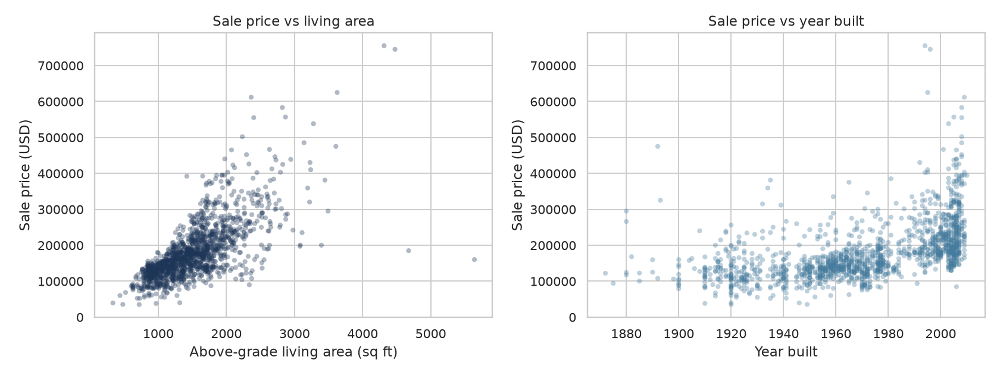

# House Price Predictor

### From-scratch linear & Bayesian models, engineered features, Elastic Net, LightGBM, and a Kaggle-ready pipeline on Ames Housing

Predict residential sale prices while *seeing the math* — OLS, ridge, Lasso/Elastic Net, conjugate Bayes, MCMC, and hierarchical neighborhood pooling — then beat the linear ceiling with LightGBM. Includes calibration checks, diagnostics, a Streamlit demo, and a one-command submission CSV.

<p align="center">
  
</p>

---

## Why this project

Most housing tutorials call `model.fit()` and move on. This repo does the opposite:

- **Implements classical estimators by hand** (stable linear algebra, not toy `np.linalg.inv` demos)
- **Engineers real features** — ordinal qualities, target-encoded `Neighborhood`, `OverallQual × GrLivArea`
- **Compares an ablation ladder** — 2 raw features → corr≥0.5 → engineered → trees
- **Quantifies & calibrates uncertainty** — Bayesian intervals with coverage / PIT diagnostics
- **Ships the full ML loop** — tests, CI, saved `joblib` bundle, Kaggle `submission.csv`, Streamlit app

## Results at a glance

Hold-out split (20%, seed 42). Re-generate with `python scripts/run_comparison.py`.

### Feature ablation (OLS)

| Feature set | RMSE | MAE | R² |
|---|---:|---:|---:|
| `GrLivArea` + `YearBuilt` | $44.2k | $28.1k | 0.616 |
| Corr ≥ 0.5 numerics (10) | $28.2k | $19.3k | 0.844 |
| **Engineered (28 feats)** | **$23.0k** | **$16.2k** | **0.896** |

### Engineered-feature bake-off

| Model | RMSE | MAE | R² |
|---|---:|---:|---:|
| **Ridge CV (from scratch)** | **$22.6k** | **$16.1k** | **0.899** |
| Elastic Net / Lasso (CV) | $22.9k | $16.0k | 0.897 |
| OLS / Bayesian MAP | $23.0k | $16.2k | 0.896 |
| LightGBM | $24.8k* | $15.6k | 0.879 |

\*LightGBM wins on MAE here and is kept as the nonlinear baseline; the saved production bundle picks the **best validation R²** model (currently Ridge CV).

Bayesian 95% predictive coverage on the log target ≈ **0.95** (well calibrated); see notebook `08_calibration.ipynb`.

## Quick start

```bash
git clone https://github.com/juandapradam12/HousePricePredictor.git
cd HousePricePredictor
python -m venv .venv && source .venv/bin/activate
pip install -e ".[dev,demo]"

# Linux (once) for PyMC / PyTensor:
# sudo apt-get install -y python3-dev

pytest -q
python scripts/run_comparison.py          # metrics + joblib bundle + submission.csv
streamlit run app/streamlit_app.py        # interactive demo
```

## What's inside

| Path | Purpose |
|---|---|
| `src/house_price_predictor/` | Package: features, OLS, Ridge, Bayes, Elastic Net, LightGBM, MCMC, hierarchical Bayes, calibration, diagnostics, persistence, submission |
| `notebooks/` | Guided tour `01`–`09` (EDA → models → diagnostics → calibration → hierarchical Bayes) |
| `notebooks/archive/` | Original educational notebooks |
| `scripts/run_comparison.py` | Ablation + bake-off + bundle + Kaggle CSV |
| `app/streamlit_app.py` | Interactive price demo |
| `tests/` | Unit + integration tests |
| `.github/workflows/ci.yml` | pytest + comparison smoke test |
| `docs/DOCUMENTATION.md` | Math, API, design decisions |
| `artifacts/` | Metrics JSON, `submission.csv`, `models/best_model.joblib` |

## Feature engineering

```text
ordinal qualities  Ex/Gd/TA/Fa/Po → 5..1 (NA → 0)
Neighborhood       mean target encoding (train-only, rare → global mean)
interaction        OverallQual × GrLivArea
numeric base       OverallQual, GrLivArea, garage/basement/bath/year, LotArea, …
outliers           GrLivArea > 4000 dropped on train
target             log1p(SalePrice)
```

## Models

| Model | Idea |
|---|---|
| **OLS** | `np.linalg.lstsq` closed form |
| **Ridge** | L2; intercept unpenalized; 5-fold CV for λ |
| **Lasso / Elastic Net** | L1 / mixing; CV for α & l1_ratio |
| **Bayesian MAP** | Gaussian prior → closed-form μ, Σ + predictive σ |
| **MCMC (PyMC 5)** | NUTS sampling; synthetic recovery + housing |
| **Hierarchical Bayes** | `α_neigh ~ N(μ_α, τ_α)` partial pooling |
| **LightGBM** | Nonlinear baseline / production bundle default |

## Example

```python
from house_price_predictor import load_housing_data, build_feature_frame, select_elastic_net_cv
from house_price_predictor.submission import make_submission
import numpy as np

train, test = load_housing_data()
eng_tr, eng_te = build_feature_frame(train, test, log_target=True)
model, alpha, l1 = select_elastic_net_cv(eng_tr.X, eng_tr.y)
print(eng_tr.schema.feature_names, alpha, l1)
make_submission(model, eng_tr.schema, test, "artifacts/submission.csv")
```

## Notebooks

1. Exploratory analysis  
2. Least squares  
3. Ridge + CV  
4. Bayesian regression  
5. MCMC (PyMC)  
6. Model comparison  
7. Diagnostics (residuals, Cook’s D, learning curves)  
8. Interval calibration (coverage + PIT)  
9. Hierarchical Bayes by neighborhood  

## Documentation

Full derivations, API notes, and changelog: **[docs/DOCUMENTATION.md](docs/DOCUMENTATION.md)**.

## Data

[Ames Housing](https://www.kaggle.com/c/house-prices-advanced-regression-techniques) (Dean De Cock). `data/test.csv` has no labels — use `artifacts/submission.csv` for challenge upload.

## License

Educational / portfolio project. Dataset subject to Kaggle / original authors' terms.
