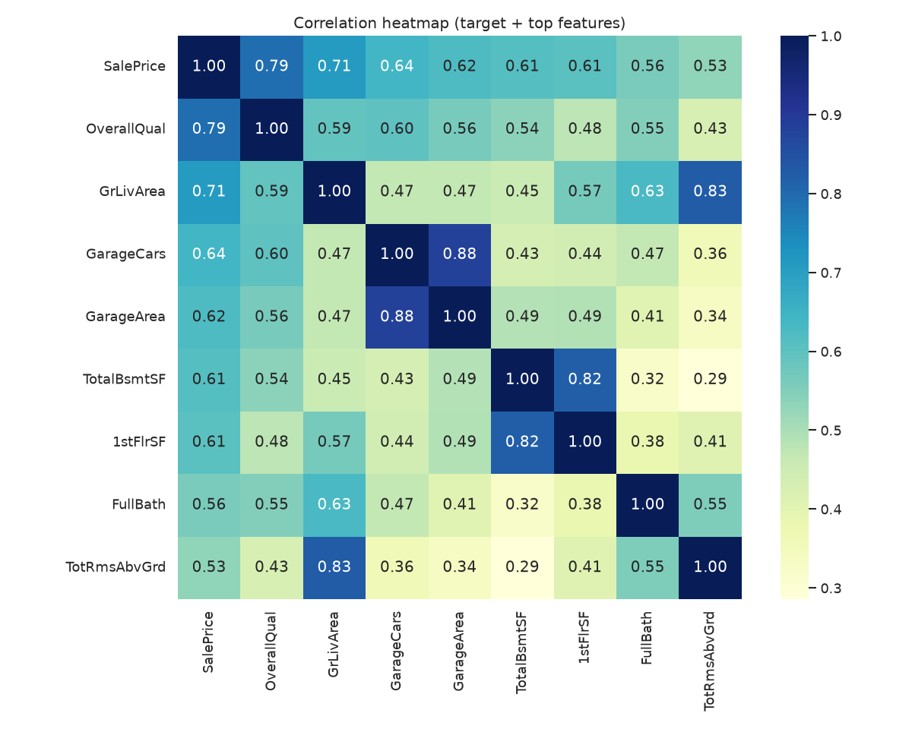
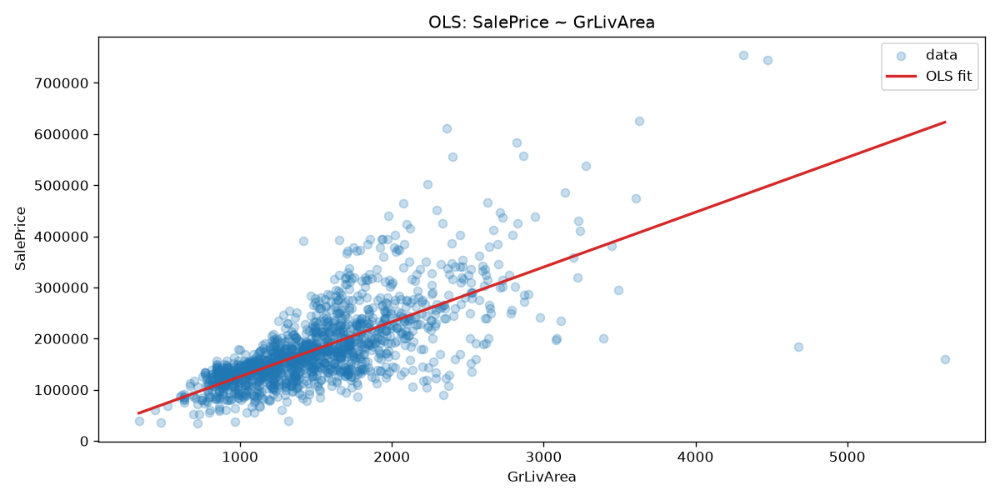
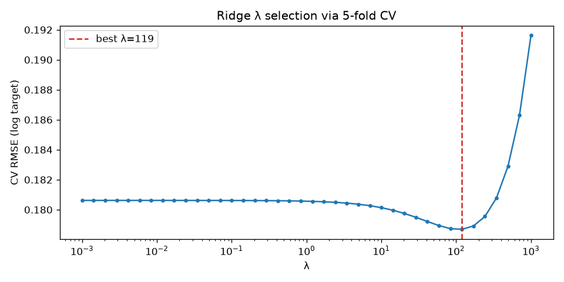
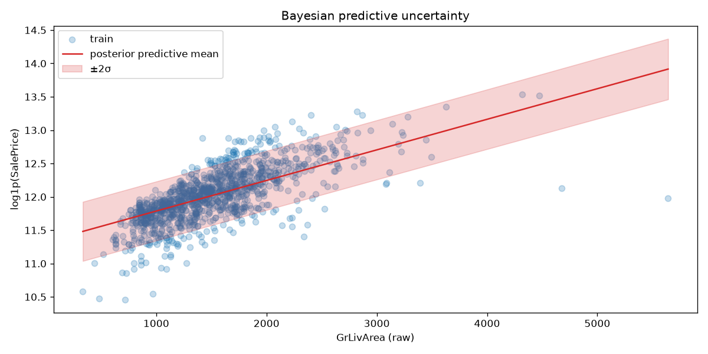
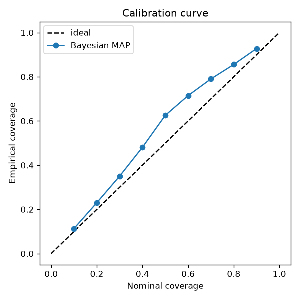
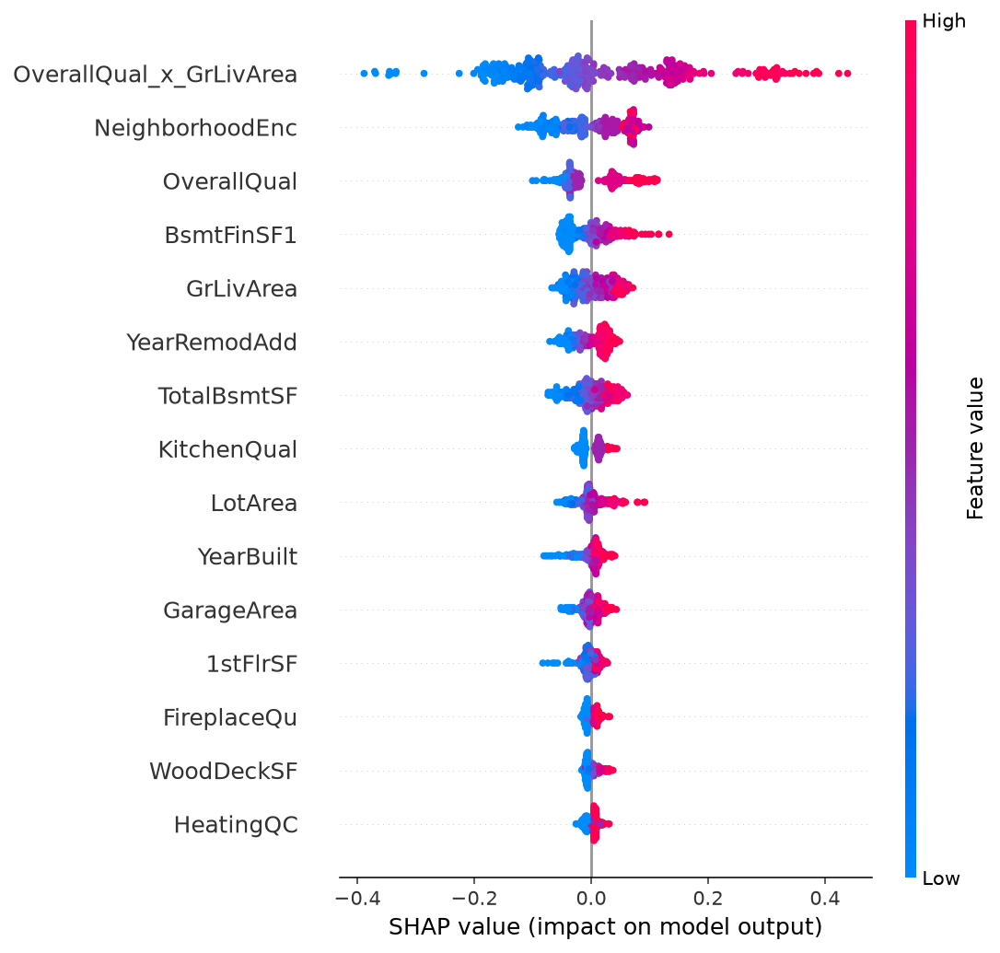
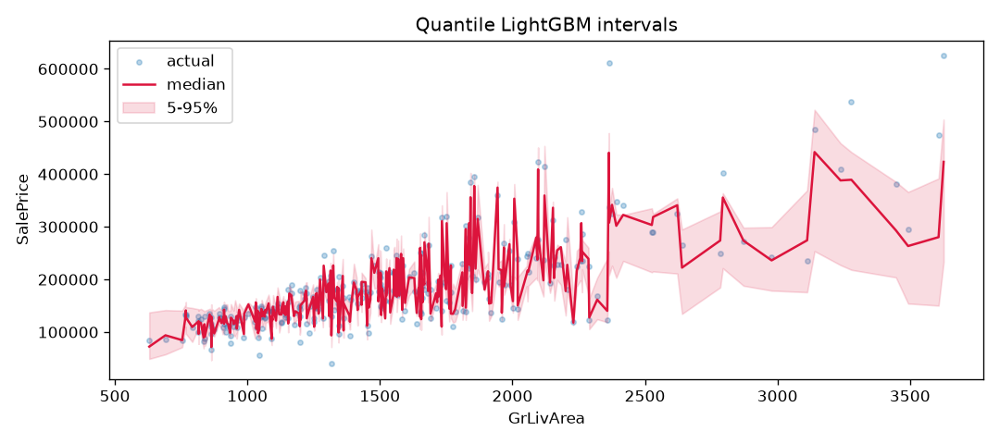
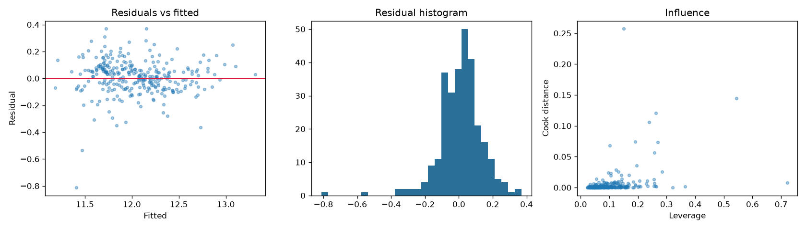

# House Price Predictor

### From the algebra of a price to a prediction on display.

House-price modeling on the [Ames Housing](https://www.kaggle.com/c/house-prices-advanced-regression-techniques) dataset: **from-scratch linear & Bayesian estimators**, leakage-safe feature engineering, **Optuna-tuned LightGBM**, a **Ridge + LightGBM stack**, SHAP explanations, calibrated uncertainty, and a Dockerized Streamlit demo — with tests and CI.

<p align="center">
  
</p>

<p align="center"><em>Sale price rises with living area and with newer construction — two of the strongest raw signals in the data.</em></p>

---

## The use case

**Question:** given a house’s attributes in Ames, Iowa, what should it sell for — and how sure are we?

The project walks that question end-to-end:

| Layer | What is in the repo |
|---|---|
| **Models** | OLS, Ridge, conjugate Bayes, and MCMC implemented from the estimators |
| **Accuracy** | Engineered features + stack → hold-out **R² ≈ 0.91**, RMSE ≈ **$21.4k** |
| **Uncertainty** | Bayesian predictive coverage ≈ **94%** at nominal 95%; quantile bands for trees |
| **Explanation** | SHAP beeswarm & bar plots for the boosted model |
| **Delivery** | `joblib` bundle, Kaggle `submission.csv`, Streamlit UI, Docker image |

## Figures

### Data & relationships

<p align="center">
  
</p>

**Correlation heatmap.** Pearson associations between `SalePrice` and the strongest numeric fields. Overall quality, above-grade living area, garage size, basement area, and year built sit at the top of the ladder — the starting point before ordinals, neighborhood encoding, and one-hots enter the pipeline.

### Classical fits

<p align="center">
  
</p>

**Ordinary least squares.** A closed-form line of `SalePrice` on living area alone. Simple, readable, and already enough to show the main size–price slope (and the scatter that a single feature cannot absorb).

<p align="center">
  
</p>

**Ridge λ via cross-validation.** Validation RMSE on the log target as a function of the L2 penalty. The dashed line marks the λ chosen by 5-fold CV — shrinkage when many correlated features sit in the design matrix.

### Uncertainty, checked

<p align="center">
  
</p>

**Bayesian predictive band.** Posterior predictive mean ± 2σ for a conjugate Gaussian linear model (living area on the x-axis, year built held at its mean). The shaded region is the model’s stated uncertainty on `log1p(SalePrice)`, not just a point fit.

<p align="center">
  
</p>

**Calibration curve.** Nominal coverage (x) versus empirical coverage on hold-out (y). Points near the diagonal mean the Bayesian intervals land about as often as they claim — here ~94% at a nominal 95%.

### What the tree model uses — and how wide it is

<p align="center">
  
</p>

**SHAP mean |impact|.** Global importance for the LightGBM fit: which engineered features move the prediction most, on average, across the sample.

<p align="center">
  
</p>

**SHAP beeswarm.** Each point is one house. Color is feature value (low → high); horizontal position is the effect on the model output. High quality / large area push price up; the spread shows how uneven that effect is across listings.

<p align="center">
  
</p>

**Quantile intervals (5–95%).** Non-parametric bands from quantile LightGBM against living area: median prediction as the line, shaded range as the interval, scatter as hold-out prices. A second view of uncertainty when conjugacy is dropped.

### Residual health

<p align="center">
  
</p>

**Diagnostics for engineered OLS.** Left: residuals vs fitted (structure / heteroscedasticity). Center: residual histogram (approximate symmetry around zero). Right: Cook’s distance vs leverage (influential points).

## Results

Hold-out **20%** of train (seed 42). Numbers below come from `python scripts/run_comparison.py`.

### Feature ablation (OLS)

| Feature set | RMSE | MAE | R² |
|---|---:|---:|---:|
| Living area + year built only | $44.2k | $28.1k | 0.616 |
| Top numeric correlates (\|r\| ≥ 0.5) | $28.2k | $19.3k | 0.844 |
| **Engineered + OOF encoding + one-hots (46 feats)** | **$21.9k** | **$15.3k** | **0.905** |

Most of the gain comes from the feature set, not from switching the estimator.

### Model comparison

| Model | RMSE | MAE | R² |
|---|---:|---:|---:|
| **Stack (Ridge + LightGBM)** | **$21.4k** | **$14.7k** | **0.910** |
| Ridge (CV-tuned λ) | $21.7k | $15.3k | 0.908 |
| Elastic Net / Lasso | $21.9k | $15.3k | 0.906 |
| OLS / Bayesian MAP | $21.9k | $15.3k | 0.905 |
| LightGBM (Optuna) | $23.6k | $15.1k | 0.891 |

`artifacts/models/best_model.joblib` stores the best hold-out R² model (currently the stack).

## Quick start

```bash
git clone https://github.com/juandapradam12/HousePricePredictor.git
cd HousePricePredictor
python -m venv .venv && source .venv/bin/activate
pip install -e ".[dev,demo]"

# Once on Linux (PyMC / PyTensor C extensions):
# sudo apt-get install -y python3-dev

pytest -q
python scripts/run_comparison.py    # metrics, SHAP, bundle, submission.csv
streamlit run app/streamlit_app.py  # interactive demo

# Or one command:
docker compose up --build
```

`HPP_FAST=1` shortens Optuna in `scripts/run_comparison.py` (CI smoke mode).

## Repository map

```text
HousePricePredictor/
├── data/                      # Ames train.csv / test.csv
├── src/house_price_predictor/ # installable modeling package
├── notebooks/                 # 01–11 guided tour (+ archive/)
├── scripts/run_comparison.py  # ablation + bake-off + artifacts
├── app/streamlit_app.py       # demo UI
├── figures/                   # README gallery plots
├── artifacts/                 # metrics, SHAP, submission, joblib
├── docs/
│   ├── DOCUMENTATION.md       # math, API, design, changelog
│   └── MODEL_CARD.md          # intended use, ethics, limits
├── Dockerfile / docker-compose.yml
└── .github/workflows/ci.yml
```

| Path | Role |
|---|---|
| `src/house_price_predictor/` | Features, OLS, Ridge, Bayes, Elastic Net, LightGBM/Optuna, stack, SHAP, quantiles, MCMC, hierarchical Bayes, calibration, diagnostics, persistence, submission |
| `notebooks/01`–`11` | EDA → models → diagnostics → calibration → hierarchical Bayes → SHAP → quantiles |
| `notebooks/archive/` | Original educational notebooks (preserved) |
| `figures/` | Committed plots used in this README |
| `docs/DOCUMENTATION.md` | Full technical write-up |
| `docs/MODEL_CARD.md` | Use / misuse / fairness notes |

## Feature engineering (leakage-aware)

```text
target             log1p(SalePrice)
outliers           drop train rows with GrLivArea > 4000
ordinals           Ex/Gd/TA/Fa/Po → 5..1 (missing → 0)
Neighborhood       out-of-fold target encoding on train;
                   full-data means stored for serve-time / test
one-hot            MSZoning, SaleCondition, GarageType
interaction        OverallQual × GrLivArea
numerics           quality, area, garage, basement, baths, years, LotArea, …
imputation         train medians only
```

## Models

| Model | Why it’s here |
|---|---|
| **OLS / Ridge / Bayesian MAP** | Closed-form estimators, derived and checked against sklearn |
| **MCMC (PyMC 5)** | Posterior sampling when conjugacy is dropped |
| **Hierarchical Bayes** | Neighborhood partial pooling |
| **Lasso / Elastic Net** | Sparse shrinkage with CV |
| **LightGBM + Optuna** | Tuned nonlinear baseline |
| **Stack** | OOF Ridge + LightGBM → linear meta-learner |
| **Quantile LightGBM** | 5% / 50% / 95% prediction intervals |

## Minimal API example

```python
from house_price_predictor import (
    load_housing_data,
    build_feature_frame,
    tune_lightgbm_optuna,
    StackingRegressor,
)
from house_price_predictor.submission import make_submission

train, test = load_housing_data()
eng_tr, _ = build_feature_frame(train, test, oof_target_encoding=True)

_, params, cv_rmse = tune_lightgbm_optuna(eng_tr.X, eng_tr.y, n_trials=20)
stack = StackingRegressor(lgbm_params=params).fit(eng_tr.X, eng_tr.y)

make_submission(stack, eng_tr.schema, test, "artifacts/submission.csv")
print("CV RMSE (log):", cv_rmse)
```

## Notebook tour

| # | Notebook | Focus |
|---|---|---|
| 01 | Exploratory analysis | Correlations, target skew, visuals |
| 02 | Least squares | From-scratch OLS vs sklearn |
| 03 | Ridge regression | Standardization + CV for λ |
| 04 | Bayesian regression | MAP, Σ, predictive uncertainty |
| 05 | MCMC (PyMC) | NUTS on synthetic + housing |
| 06 | Model comparison | Package bake-off entrypoint |
| 07 | Diagnostics | Residuals, Cook’s D, learning curves |
| 08 | Calibration | Coverage curve + PIT |
| 09 | Hierarchical Bayes | Varying intercepts by neighborhood |
| 10 | SHAP | Tree explanations |
| 11 | Quantile intervals | 5–95% LightGBM bands |

## Documentation

- **[docs/DOCUMENTATION.md](docs/DOCUMENTATION.md)** — problem setup, math, API reference, design decisions, changelog  
- **[docs/MODEL_CARD.md](docs/MODEL_CARD.md)** — intended use, evaluation protocol, ethics, limitations  

## Data

[Ames Housing dataset](https://www.kaggle.com/c/house-prices-advanced-regression-techniques) (Dean De Cock). Labels are USD sale prices; `data/test.csv` has no `SalePrice` (Kaggle submission format).

## License

Educational / portfolio project. Dataset subject to Kaggle and original authors’ terms.
